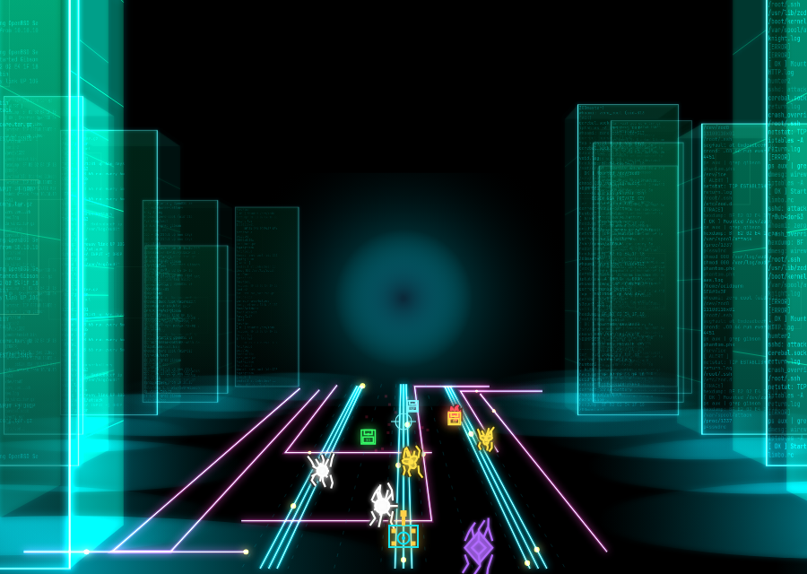
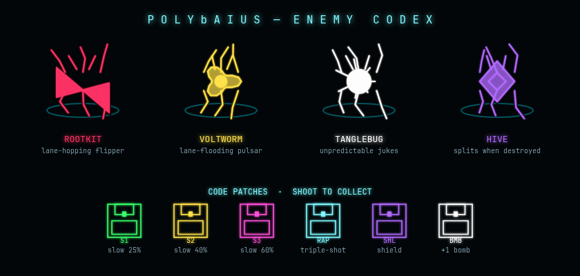

# PolybAIus

A browser-based, Tempest-inspired arcade shooter set inside the mainframe of the
supercomputer **ZOD**, styled after the *Hackers* (1995) "Gibson" cyberspace
sequences.

You are ZOD's defense cannon — a PCB-layout component turret seated in a glowing
corridor between towering data monoliths. Viruses and intrusion bugs — small
creatures with animated limbs — descend the corridor toward you. Nothing gets
past the rim.



> Play it: open `samples/corridor-sample-v5.html` in any browser, or serve the
> repo statically (`python3 -m http.server 8080`). No build step, no backend.

## Status

**Pre-production → playable prototype.** All design decisions (D1–D18) are
locked in `docs/decision-log.md`. The current reference prototype is
`samples/corridor-sample-v5.html`; the production game will be built in `src/`.

## Gameplay

Core loop (Tempest mechanics, Gibson presentation):

- A **PCB cannon** slides side-to-side along the corridor mouth, aimed with the
  mouse; **left click** fires fast laser bolts, **right click** detonates a bomb.
- **No bug may reach the bottom** — a breach costs a life (3 to start; game over
  at zero).
- Enemy speed starts slow and ramps gradually with total kills (smooth, capped)
  so early play is comfortable and pressure builds late — a good run should
  last 15–25 minutes.

### Enemies (Tempest roles, hacker names)

| Enemy | Tempest analog | Behavior |
|---|---|---|
| Rootkit | Flipper | hops lane-to-lane toward the rim |
| Voltworm | Pulsar | periodically floods its lane |
| Tanglebug | Fuseball | jukes unpredictably, hard to hit |
| Hive | Tanker | slow, tanky, splits when destroyed |



### Code patches (power-ups)

Floppy-disk icons drift down the lanes. **They must be shot to collect** — one
that lands un-shot fizzles with no effect.

| Patch | Color | Effect |
|---|---|---|
| S1 | green | slow viruses 25% for 6s (drifts slow — easy) |
| S2 | amber | slow viruses 40% for 6s |
| S3 | magenta | slow viruses 60% for 6s (drifts fast — hard to hit) |
| RAP | cyan | triple-shot laser for 8s |
| SHL | violet | absorbs the next breach |
| BMB | white | +1 bomb |

### How a run plays

1. **Descend & defend.** Bugs spawn at the far end of the corridor and advance
   down one of 8 lanes toward your cannon. Anything that reaches the bottom
   costs a life — you have 3, and there are no continues.
2. **Ramp.** Enemy speed and spawn rate start gentle and rise smoothly with
   your total kill count (hard-capped), so the first minute is calm and the
   pressure compounds over time. Bug variety widens as you rack up kills
   (Tanglebugs after 12, Hives after 30).
3. **Waves & levels.** Clearing a wave's quota of bugs advances the level;
   each level re-rolls the corridor — new tower heights, a shifted color
   scheme, and fresh tower text — and raises the wave quota.
4. **Patches.** Floppy disks drift down occasionally. Shoot them to collect;
   a disk that lands un-shot is wasted. Tiers trade risk for power: the
   slow-drifting green S1 is easy to hit but only slows viruses 25%, while
   the fast magenta S3 is a hard target worth 60% slowdown.
5. **Game over.** At zero lives the run ends. If your score makes the top 10
   you enter 3-letter arcade initials; the table persists in `localStorage`.
6. **Chase the multipliers.** The combo chain (×8 max) and bomb-award kill
   streaks both die on a missed shot or a breach — the high-score chase is
   about accuracy under pressure, not just speed.

### Scoring

- Base points per bug, multiplied by a **combo chain** — consecutive hits
  without a miss build the multiplier (up to ×8); a missed shot or a breach
  resets it.
- **Bombs:** start with 3; a kill streak with no misses and no damage at
  escalating thresholds (first at 15) awards another — deliberately hard to
  chain.
- Extra life every 75,000 points (max 6 in reserve).
- **High scores:** arcade-style top-10 table with 3-letter initials entry,
  persisted in `localStorage` — works offline, zero backend.

## Visual direction

Everything on screen is emissive neon on a void-black Gibson corridor, rendered
with **"lightweight 3D"**: Canvas 2D with manual one-point perspective
projection (2.5D) — flat neon look kept, depth from scale-by-distance geometry.
No WebGL.

- Low eye level; horizon just above mid-frame; the nearest data monoliths exit
  the top of the frame.
- Towers are translucent additive boxes — text-as-texture (log lines, directory
  trees, hex dumps, password strings, netstat tables), wireframe sub-panels,
  white-hot edges, base flares.
- The floor is a PCB: bundled 3-track orthogonal bus traces with traveling
  pulses.
- Every level re-rolls tower heights, color scheme, and text content.
- Six selectable palettes: **Gibson Cyan (default)**, Toxic Terminal,
  Violet Flux, Amber Mainframe, Glacier Ice, Red Alert.
- CRT finish: scanlines over the canvas.

## Controls

| Input | Action |
|---|---|
| Mouse move | slide the cannon / aim |
| Left click | fire laser |
| Right click | bomb |
| M | mute (WebAudio procedural SFX) |
| Keyboard | initials entry on game over |

## Repository layout

```
docs/      design brief, decision log (D1–D18), implementation plans
samples/   visual/gameplay prototypes (v1–v5; v5 is the reference)
src/       production game (to be built from the plan)
assets/    fonts, sprites, audio (currently none — everything is procedural)
```

## Running

No dependencies, no build step:

```
python3 -m http.server 8080
# open http://localhost:8080/samples/corridor-sample-v5.html
```

## Deployment (planned)

Static hosting on the homelab, exposed via Cloudflare — mirroring the
scotthepburn.com pattern:

- `caddy:2-alpine` container deployed as a Dockhand Docker Compose stack
  (docker-staging first, then docker-prod).
- Public URL via the existing Cloudflare tunnel: `polybaius.endofline.io`.
- Cloudflare/DNS changes are made from docker-prod egress only.

## Versioning

Semantic versioning; see [CHANGELOG.md](CHANGELOG.md). Current: **v0.1.1**
(pre-production prototype, visual direction locked, README documented).

## Roadmap

- [ ] Production implementation in `src/` (modular: renderer, entities, waves, UI)
- [ ] Level warp sequence + corrupted-trace dodge
- [ ] Skill-Step starting level
- [ ] Difficulty curve tuning for 15–25 minute runs
- [ ] Caddy stack deploy + Cloudflare tunnel hostname
